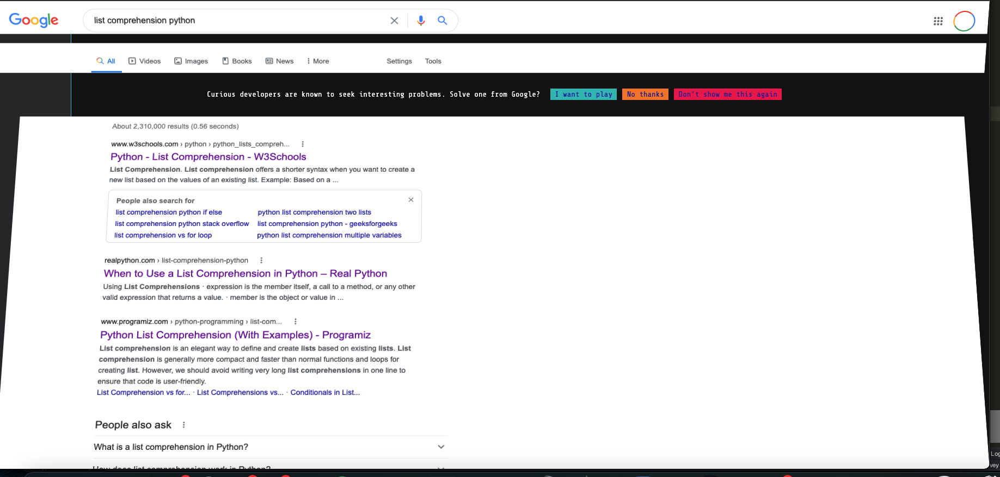

# google-foobar
This is my google foobar challenge – a secret google hiring challenge for programmers who receive the opportunity, asking algorithmic topics such as graph theory and dynamic programming. I've currently completed up to level 4 of the 5 levels, and received the opportunity to send my info to a google recruiter for an interview at google. 

